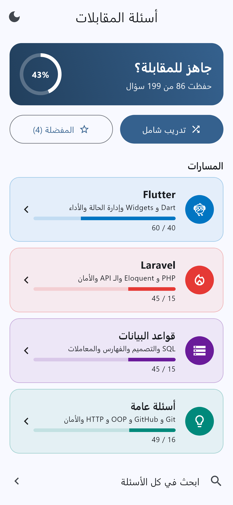
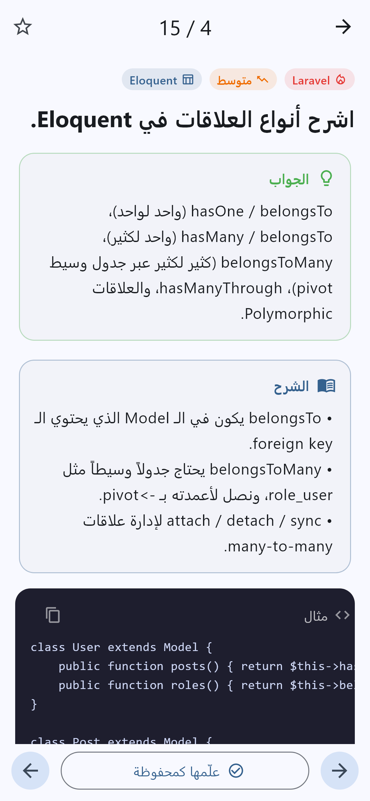
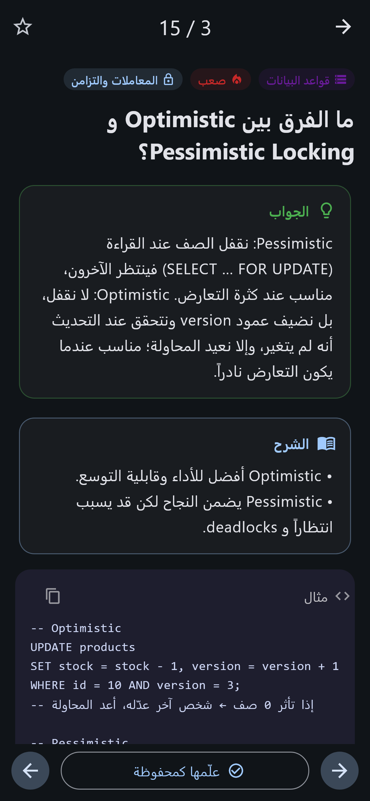
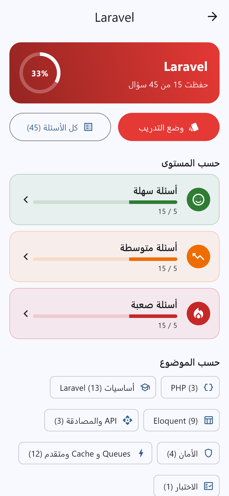
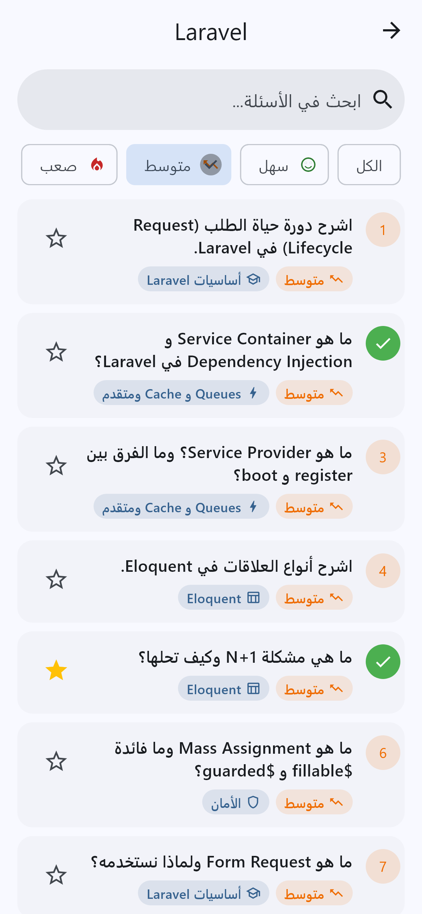
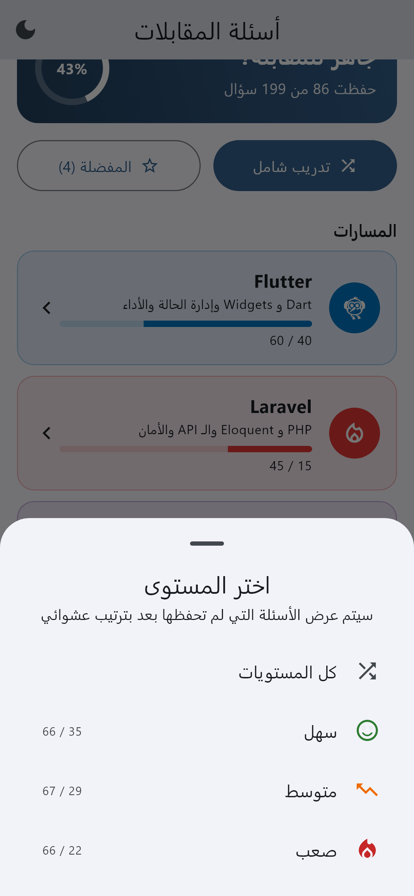
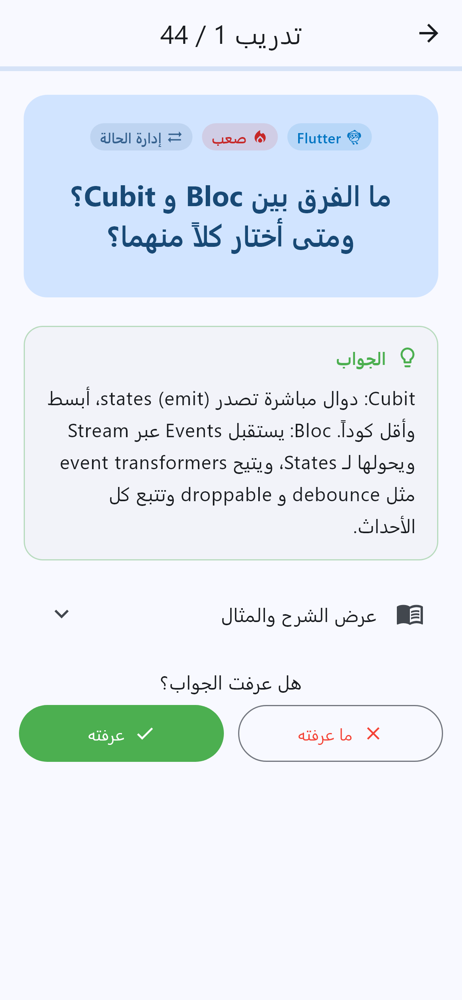
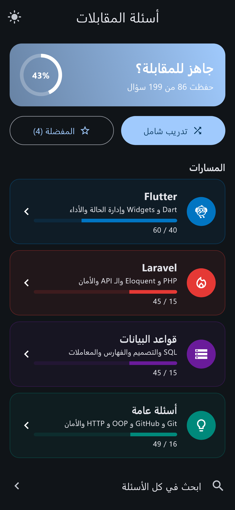

<div dir="rtl">

# أسئلة المقابلات 🎯

تطبيق Flutter للتحضير لمقابلات العمل البرمجية. فيه **199 سؤال وجواب** موزعة على أربعة مسارات: **Flutter**، **Laravel**، **قواعد البيانات**، و**أسئلة عامة** (Git و GitHub، OOP، HTTP، الأمان، الخوارزميات، والأسئلة الشخصية).

لكل سؤال:
- **جواب مختصر** بتقدر تقوله بالمقابلة
- **شرح** بنقاط واضحة
- **مثال كود** لأغلب الأسئلة (Dart، PHP، SQL، أوامر git)

</div>

<p align="center">
  
  
  
</p>

<div dir="rtl">

## المميزات

- **أربعة مسارات**، ولكل مسار ثلاث مستويات (سهل، متوسط، صعب) ومواضيع فرعية.
- **وضع التدريب**: بيعرضلك الأسئلة يلي لسا ما حفظتها بترتيب عشوائي. بتفكر بالجواب، بتكشفه، وبتقيّم حالك، وبالآخر بتطلعلك النتيجة مع خيار تعيد الأسئلة يلي فاتتك.
- **تتبع التقدم**: بتعلّم الأسئلة يلي حفظتها، وبتشوف نسبة تقدمك بكل مسار وكل مستوى.
- **المفضلة**: بتحفظ الأسئلة المهمة لترجعلها بسرعة.
- **بحث** بنص السؤال والجواب والشرح.
- **التنقل بالسحب** بين الأسئلة بصفحة التفاصيل.
- **نسخ الكود** بضغطة وحدة.
- **الوضع الليلي**، وواجهة كاملة من اليمين لليسار.
- التقدم والمفضلة بينحفظوا على الجهاز.

## لقطات الشاشة

</div>

| الرئيسية | المسار | قائمة الأسئلة | تفاصيل السؤال |
|:---:|:---:|:---:|:---:|
|  |  |  |  |

| اختيار التدريب | وضع التدريب | الرئيسية (ليلي) | التفاصيل (ليلي) |
|:---:|:---:|:---:|:---:|
|  |  |  |  |

<div dir="rtl">

## محتوى الأسئلة

| المسار | سهل | متوسط | صعب | المواضيع |
|---|:---:|:---:|:---:|---|
| **Flutter** | 20 | 20 | 20 | Dart، Widgets، إدارة الحالة، Async، التنقل، الأداء، المعمارية، آلية العمل الداخلية، الاختبار، المنصات والنشر |
| **Laravel** | 15 | 15 | 15 | PHP، أساسيات Laravel، Eloquent، API والمصادقة، الأمان، Queues و Cache، الاختبار |
| **قواعد البيانات** | 15 | 15 | 15 | SQL، Joins، التصميم والتطبيع، الفهارس والأداء، المعاملات والتزامن، NoSQL والتوسع |
| **أسئلة عامة** | 16 | 17 | 16 | Git و GitHub، OOP و SOLID، Design Patterns، HTTP والويب، الأمان، هياكل البيانات والخوارزميات، ممارسات وأدوات، أسئلة شخصية |

## التشغيل

المتطلبات: Flutter 3.44 أو أحدث (Dart 3.12).

</div>

```bash
flutter pub get
flutter run
```

<div dir="rtl">

البناء:

</div>

```bash
flutter build apk --release          # APK واحد لكل المعالجات
flutter build apk --split-per-abi    # ملفات أصغر لكل معالج
flutter build appbundle              # للرفع على Google Play
flutter build web
```

<div dir="rtl">

## هيكل المشروع

</div>

```
lib/
├── main.dart                     # نقطة البداية، الثيم، اتجاه RTL
├── models/question.dart          # Level و Track و Category و Question
├── data/
│   ├── questions.dart            # يجمع كل المسارات + questionsOf(track)
│   ├── flutter_questions.dart    # IDs 1–60
│   ├── laravel_questions.dart    # IDs 1001+
│   ├── database_questions.dart   # IDs 2001+
│   └── general_questions.dart    # IDs 3001+
├── state/app_state.dart          # المفضلة والتقدم والوضع الليلي (shared_preferences)
├── screens/
│   ├── home_screen.dart          # المسارات والتقدم العام
│   ├── track_screen.dart         # المستويات والمواضيع لمسار واحد
│   ├── question_list_screen.dart # بحث وفلترة
│   ├── question_detail_screen.dart
│   └── practice_screen.dart      # وضع التدريب
└── widgets/common.dart           # الشارات، بلوك الكود، شريط التقدم...
```

<div dir="rtl">

إدارة الحالة معمولة بـ `ChangeNotifier` مع `InheritedNotifier`، بدون مكتبات خارجية. المكتبة الوحيدة المضافة هي `shared_preferences`.

## إضافة سؤال جديد

زيد عنصر `Question` على ملف المسار المناسب بـ `lib/data/`، وانتبه يكون الـ `id` **فريد**. هاد الرقم هو يلي بينحفظ فيه التقدم، فلا تغيّر أرقام الأسئلة الموجودة.

</div>


```dart
Question(
  id: 1046,
  level: Level.medium,
  category: Category.eloquent,
  question: 'نص السؤال؟',
  answer: 'الجواب المختصر.',
  explanation:
      '• نقطة أولى.\n'
      '• نقطة ثانية.',
  code: r'''
User::with('posts')->get();''', // اختياري
),
  
```

## 📥 Download the App

👉 [Download FlutterQuesions APK V1.0.0](https://github.com/huzaifakhashan/flutter_questions/releases/tag/v1.0.0)

👉 [Download FlutterQuesions exe v1.0.0 for windows](https://github.com/huzaifakhashan/flutter_questions/releases/tag/v1.0)

